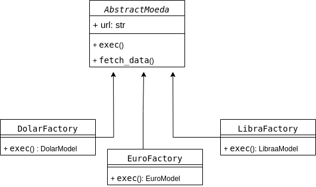

# Desafio Cotação - API Assíncrona

API RESTful totalmente assíncrona construída com **FastAPI**, utilizando **Pydantic**, **SQLAlchemy**, **aiosqlite** e servida por **Uvicorn**.

---

#### 🛠 Tecnologias Utilizadas

- ⚡ [FastAPI](https://fastapi.tiangolo.com/) — Framework web assíncrono  
- 📦 [Pydantic](https://pydantic.dev/) — Validação de dados  
- 🗃 [SQLAlchemy](https://www.sqlalchemy.org/) — ORM  
- 🔄 [aiosqlite](https://github.com/jreese/aiosqlite) — Driver assíncrono para SQLite  
- 🚀 [Uvicorn](https://www.uvicorn.org/) — Servidor ASGI leve  
- 🧪 [Locust](https://locust.io/) — Teste de Carga

---

#### 🧱 Padrão de Projeto

- 🏗 **Factory Pattern** para inicialização desacoplada e flexível dos componentes da aplicação.

- cada classe factory retornatá um objeto criado respectivo ao seu tipo para posterior comparação
---

### 📌 Endpoints

#### 🔍 `GET /cotacoes`
- http://localhost:8001/cotacoes
Obtém a menor cotação entre diversas fontes externas.  
**Parâmetros:** Nenhum  
**Resposta:** JSON com a menor cotação.

#### 📬 `POST /callback`
- http://localhost:8001/callback

Recebe dados de callback com identificador da requisição e payload adicional.

**Exemplo de Payload:**

```json
{
  "request_id": "uuid",
  "data": { "qualquer": "json" }
}
```

- `request_id`: UUID  
- `data`: JSON genérico  

#### 📄 `GET /docs`
- http://localhost:8001/docs
Interface Swagger automática com toda a documentação da API.

---

### ▶️ Como Usar

#### ✅ Requisitos

- Docker instalado na máquina

---

#### 💻 Rodando localmente com Docker Compose

```bash
# Crie e acesse o diretório do projeto
mkdir teste-amigoz
cd teste-amigoz
```
```bash
# Clone o repositório
sudo git clone https://github.com/Deivison07/teste-amigoz.git .
```
```bash
# Execute com Docker Compose
sudo docker-compose up --build
```

---

### ℹ️ Observações

- A aplicação é **100% assíncrona**, garantindo melhor desempenho em operações I/O.
- A documentação da API está disponível em: `http://localhost:8001/docs`

---

### Teste de Carga com Locust
- A aplicação inclui testes de carga e desempenho utilizando o Locust. O script está localizado em:

```bash
./teste/locustfile.py
```
- Esse script simula múltiplos usuários acessando os endpoints da API, avaliando tempo de resposta, taxa de requisição e resistência.

#### Instalação do Locust

```bash
pip install locust
```
- Ou com ambiente virtual:

```bash
python3 -m venv venv
source venv/bin/activate
pip install locust
```

#### Executando o Teste

- Execute o Locust no diretório do projeto
```bash
locust -f ./teste/locustfile.py
```
--- 
### 🤝 Contato

Para dúvidas ou contribuições:

- 💬 Abra uma **issue** no repositório
- ✉️ Desenvolvedor: *Deivison Alcantara*

---

🧑‍💻 *Desenvolvido com dedicação por Deivison Alcantara*
